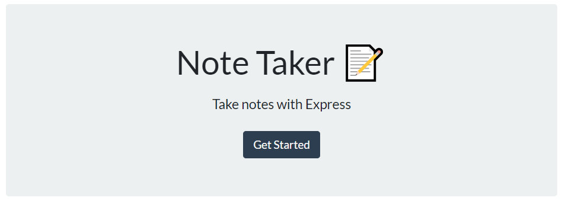

# Note-Taker

## Application 

[Note Taker Application](https://note-taker-fabio.herokuapp.com/notes)

## Description
This is a simple application utilizing express js to create a server to store, edit and delete notes

## Table of Contents
  * [Installation](#installation)
  * [Usage](#usage)
  * [Credits](#credits)
  * [License](#license)
  * [Contribute](#contributions)
  * [Tests](#tests)
  * [Questions](#questions)

## Installation
  1. clone repo on github 
  2. Install any required dependancies 
```
    npm install
```
  3. Start a local server of the application
```
    npm start
```

## Usage
  1. Once the application/server is started, it will be hosted on port 3001 of localhost 
  2. Navigate to https://localhost:3001 to see the webpage 
  3. Click on "get started" to start viewing notes 
    
  4. To add a note, fill in the note title and note text 
    
  5. Press the save icon on the upper left corner
    
  6. Save notes are displayed on the left hand side
    
  7. To edit notes, click on a note on the left, and edit the title and text and press the save icon 
    
    
  8. To delete notes, click on the red garbage icon associated with each note
    

## Credits
N/A

## License
This application is under the MIT License  
For more information please view here: [MIT Description](https://choosealicense.com/licenses/mit/)

[](https://opensource.org/licenses/MIT)

## Contributions
Feel free to clone and improve on this application!

## Tests
  No tests

## Questions

See more about my Github here:  [Fchoi1](https://www.github.com/Fchoi1)  
Any burning questions you want to ask me?  
Reach out to me! [fwchoi@uwaterloo.ca](mailto:fwchoi@uwaterloo.ca)
